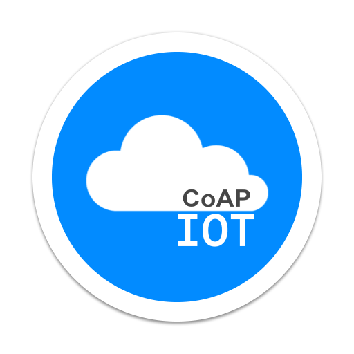

# IoT-API-Dashboard-Project

<div id="top"></div>
<!-- PROJECT LOGO -->
<div align="center">
  <a href="#"><!-- lien repo-->
    
  </a>
</div>

<p align="left">
  An integrated project for managing IoT devices, APIs, and statistical dashboards. This project focuses on efficiently handling QR code-based ticketing systems and other IoT functionalities. Explore advanced data analytics and visualizations through the provided dashboard for enhanced insights and management capabilities.
  <br />
  <br />
</p>

---

## Table of Contents

<details open>
  <summary>Click here to expand the Table of Contents</summary>
  <ol>
    <li>
      <a href="#overview">Overview</a>
      <ul>
        <li><a href="#iot-module">IoT Module</a></li>
        <li><a href="#api-module">API Module</a></li>
        <li><a href="#dashboard-module">Dashboard Module</a></li>
        <li><a href="#system-architecture">System Architecture</a></li>
      </ul>
    </li>
    <li>
      <a href="#about-the-project">About The Project</a>
      <ul>
        <li><a href="#key-features">Key Features</a></li>
      </ul>
    </li>
    <li><a href="#getting-started">Getting Started</a></li>
    <ul>
      <li><a href="#installation">Installation</a></li>
      <li><a href="#docker-usage">Docker Usage</a></li>
      <li><a href="#prerequisites">Prerequisites</a></li>
    </ul>
    <li><a href="#contributors">Contributors</a></li>
  </ol>
</details>

---

## Overview

In this project, we have three main parts :

### IoT Module

The IoT utilizes MQTT, Mosquitto, CoAP, and Flask to manage IoT devices. It includes the following features:

- MQTT for communication between IoT devices
- Mosquitto as the MQTT broker
- CoAP for RESTful communications on constrained networks
- Python and Flask to build the REST API for IoT

</br>
<div style="display: flex; align-items: center;">
  
  
  
  
  
</div>

### API Module

The API is built with Flask and utilizes a MongoDB database. Here are its main characteristics:

- Using Python and Flask to create a RESTful API
- Integration with MongoDB to store API data

</br>
<div style="display: flex; align-items: center;">
  
  
  
</div>

### Dashboard Module

The Dashboard is an interactive website with data graphs and features such as ticket purchase, simulation, and more. Here's what it offers:

- An interactive website with data graphs using chart.js
- Ticket purchase, simulation, and more functionalities

</br>
<div style="display: flex; align-items: center;">
  
  
  
</div>

### System Architecture

![Project Schema][schema]

---

## About The Project

The IoT-API-Dashboard Project is an integrated system designed to manage IoT devices, provide APIs, and offer statistical dashboards. Its main goal is to efficiently handle QR code-based ticketing systems and other IoT functionalities.

### Key Features:

- **Ticket Purchase and Wallet Integration:** The project enables clients to purchase tickets directly from the website and seamlessly integrates a wallet feature to ensure they never lose their tickets. This allows for easy access and management of tickets.

- **QR Code Simulation:** Clients can simulate their QR codes to verify their validity before use. This feature ensures that tickets are valid and can be easily authenticated.

- **Integration with IoT Devices:** The website communicates with IoT devices to send QR codes, enabling seamless interaction between the user interface and physical devices.

- **API Integration:** The project utilizes APIs to manage and retrieve data related to tickets and other system functionalities. This ensures smooth communication and data exchange between different components of the system.

The project provides advanced data analytics and visualizations through the dashboard, offering enhanced insights and management capabilities for users.

![Project Ticket List][liste_ticket]

This dashboard provides a comprehensive view of key statistics for the transportation service, enabling data-driven decision making and strategic planning."

![Project Stats][stats]

<p align="right">(<a href="#iot-api-dashboard-project">back to top</a>)</p>

## Getting Started

Provide instructions on setting up the project locally.

### Installation

1. **Clone the Repository**: Clone the VideoLibManager repository to your local machine:

   ```bash
   git clone https://github.com/Rahim21/IoT-API-Dashboard-Project.git
   ```

2. **Navigate to Project Directory**: Move into the project directory:
   ```bash
   cd IoT-API-Dashboard-Project
   ```

## Docker Usage

1. **Build Docker Containers**: To build the Docker containers, execute:

   ```bash
   sudo docker-compose up --build -d
   ```

2. **Start Containers**: Start the containers with:

   ```bash
   sudo docker-compose up -d
   ```

3. **Stop Containers**: To stop the running containers, use:
   ```bash
   sudo docker-compose down
   ```

## Prerequisites

List any prerequisites or dependencies users need to have before using the project.

- **Python**: Make sure Python is installed on your system. If not, you can download and install it from the [official Python website](https://www.python.org/downloads/).

- **Install Docker**: Ensure Docker is installed on your system. If not, follow the official [Docker installation guide](https://docs.docker.com/get-docker/).

<p align="right">(<a href="#iot-api-dashboard-project">back to top</a>)</p>

---

### Contributors

Thank you to the following contributors for their valuable contributions to this project:

<div style="display: flex; flex-wrap: wrap;">
  <div style="display: flex; align-items: center; margin-right: 20px;">
    
    <a href="https://github.com/Rahim21" style="text-decoration: none;">Rahim</a>
  </div>
  
  <div style="display: flex; align-items: center; margin-right: 20px;">
    
    <a href="https://github.com/Suhail1929" style="text-decoration: none;">Souhail</a>
  </div>
  
  <div style="display: flex; align-items: center; margin-right: 20px;">
    
    <a href="https://github.com/sami51100" style="text-decoration: none;">Sami</a>
  </div>

  <div style="display: flex; align-items: center; margin-right: 20px;">
    
    <a href="#" style="text-decoration: none;">Hugo</a>
  </div>
</div>

<!-- Markdown Links & Images -->

[accueil]: pictures/accueil.png
[liste_ticket]: pictures/liste_ticket.png
[logo]: pictures/logo.png
[simulation]: pictures/simulation.png
[schema]: pictures/schema.png
[stats]: pictures/stats.png
